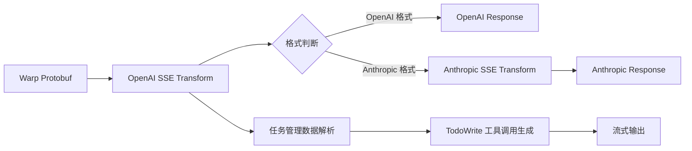

# Warp AI 任务管理协议分析文档

## 概述

本文档详细分析了 Warp AI 系统中任务管理的 Protobuf 协议结构，基于对日志数据的逆向工程分析和实际测试验证。

## 协议结构

### 1. Client Actions 结构

Warp AI 的任务管理通过 `client_actions` 中的 `actions` 数组实现，主要包含两种动作类型：

```json
{
  "client_actions": {
    "actions": [
      {
        "add_messages_to_task": { /* 添加消息到任务 */ },
        "update_task_message": { /* 更新任务消息 */ }
      }
    ]
  }
}
```

### 2. 数据传输位置

任务管理数据通过多个不同的位置传输：

| Action | 数据来源 | 数据路径 | 编码方式 | 内容结构 | 作用 |
|--------|----------|----------|----------|----------|------|
| `add_messages_to_task` | `tool_call` | `server.payload` | Base64 | `{"11": {}}` | 初始化/清空任务列表 |
| `add_messages_to_task` | `tool_call` | `call_mcp_tool` | 直接对象 | MCP工具调用 | MCP 工具调用 |
| `add_messages_to_task` | `server_event` | `payload` | 直接对象 | `{"2": {"1": [...], "2": [...]}}` | 添加任务列表 |
| `update_task_message` | `tool_call` | `server.payload` | Base64 | `{"9": {"1": "task-id"}}` | 标记正在执行的任务 |
| `update_task_message` | `server_event` | `payload` | 直接对象 | `{"2": {"1": [...], "2": [...]}}` | 更新任务列表状态 |

## 协议字段语义

### 第一层键值含义

- `2` - 任务列表数据容器
- `9` - 任务状态/执行控制
- `11` - 任务初始化/清理操作

### 第二层结构含义

- `1` - 待完成任务数组 / 正在执行的任务ID
- `2` - 已完成任务数组

### 第三层任务对象结构

```json
{
  "1": "task-uuid",        // 任务唯一标识符
  "2": "任务标题",          // 任务显示标题
  "3": "任务详细描述"       // 任务详细说明
}
```

## 具体协议示例

### 1. 初始化任务列表

**位置**: `add_messages_to_task` → `tool_call` → `server.payload`

```json
{"11": {}}  // Base64编码: "WgA="
```

### 2. 添加任务列表

**位置**: `add_messages_to_task` → `server_event` → `payload`

```json
{
  "2": {
    "1": [  // 待完成任务
      {
        "1": "ff566ea1-6879-428f-8ea8-68a2d64e0328",
        "2": "Initialize Git repository",
        "3": "Run git init to initialize the repository in the current directory"
      },
      {
        "1": "3dc2b676-2b08-4c6e-a775-ba08fc734e7e",
        "2": "Check current status and files",
        "3": "Use git status to see what files are in the working directory and their status"
      }
    ],
    "2": [  // 已完成任务（可选）
      {
        "1": "completed-task-id",
        "2": "已完成的任务标题",
        "3": "已完成的任务描述"
      }
    ]
  }
}
```

### 3. 标记正在执行的任务

**位置**: `update_task_message` → `tool_call` → `server.payload`

```json
// 单个任务
{
  "9": {
    "1": "ff566ea1-6879-428f-8ea8-68a2d64e0328"
  }
}

// 多个任务
{
  "9": {
    "1": [
      "d93d16a1-64a7-4c73-bd3d-bf90b98cd9ca",
      "00c32a19-73cd-487c-8ff7-ce4c6ad149bc"
    ]
  }
}
```

### 4. 更新任务状态

**位置**: `update_task_message` → `server_event` → `payload`

```json
{
  "2": {
    "1": [  // 剩余待完成任务
      {
        "1": "remaining-task-id",
        "2": "剩余任务标题",
        "3": "剩余任务描述"
      }
    ],
    "2": [  // 新增已完成任务
      {
        "1": "completed-task-id",
        "2": "已完成任务标题",
        "3": "已完成任务描述"
      }
    ]
  }
}
```

## 任务生命周期

```mermaid
graph TD
    A[初始化任务列表] --> B[添加任务列表]
    B --> C[标记正在执行]
    C --> D[更新任务状态]
    D --> E{还有待完成任务?}
    E -->|是| C
    E -->|否| F[任务完成]

    A --> |payload: {"11": {}}| A1[清空任务列表]
    B --> |payload: {"2": {...}}| B1[设置完整任务列表]
    C --> |payload: {"9": {...}}| C1[标记执行中任务]
    D --> |payload: {"2": {...}}| D1[更新任务状态]
```

## 与 Claude Code TodoWrite 的关系

Warp AI 的任务管理协议与 Claude Code 的 `TodoWrite` 工具完全对应：

- **Warp AI**: 通过 protobuf payload 传输任务状态
- **Claude Code**: 通过 `TodoWrite` 工具调用管理任务
- **桥接**: 通过 Anthropic SSE 转换器实现格式转换

## 当前实现状态

### OpenAI SSE 转换器 (`sse_transform.py`)
✅ **已完全实现**:
- `add_messages_to_task` 处理
  - Base64 解码 tool_call server.payload
  - 解析 protobuf 格式数据
  - 检测任务初始化事件 (`{"11": {}}`)
  - 生成 TodoWrite 工具调用清空任务
  - 处理 server_event payload 中的任务列表数据
  - 转换任务数据为 TodoWrite 格式
- `update_task_message` 处理
  - Base64 解码和 protobuf 解析
  - 检测任务状态更新 (`{"9": {"1": "task-id"}}`)
  - 生成 TaskStatusUpdate 工具调用
  - 支持单任务和多任务状态更新
  - 处理 server_event payload 中的任务更新
- `call_mcp_tool` 处理
- 完整的任务生命周期管理

### Anthropic SSE 转换器 (`anthropic_sse_transform.py`)
✅ **已实现**:
- 基础框架和流式响应结构
- 工具调用块的处理框架
- TodoWrite 工具调用透传（由 OpenAI SSE 转换器生成）
- 正确处理工具名称和参数

⚠️ **依赖上游**:
- 任务管理数据处理已在 OpenAI SSE 转换器中完成
- Anthropic 转换器直接使用已转换的 TodoWrite 工具调用
- 无需重复实现 protobuf 解析逻辑

## 实现架构

### 数据流处理架构



### 任务管理实现细节

#### OpenAI SSE 转换器中的实现 (`sse_transform.py`)

1. **任务初始化检测**：
   - 解析 Base64 编码的 payload
   - 检测 `{"11": {}}` 标识
   - 生成空 TodoWrite 调用清空任务

2. **任务列表解析**：
   - 从 `server_event.payload` 提取任务数据
   - 解析 `{"2": {"1": [...], "2": [...]}}` 结构
   - 转换为 TodoWrite 格式：
     ```json
     {
       "todos": [
         {
           "content": "任务标题",
           "status": "pending/completed",
           "activeForm": "执行 任务标题"
         }
       ]
     }
     ```

3. **任务状态更新**：
   - 解析 `{"9": {"1": "task-id"}}` 或 `{"9": {"1": [...]}}`
   - 生成 TaskStatusUpdate 工具调用
   - 支持单任务和批量任务更新

#### Anthropic SSE 转换器的角色

- **透传机制**：直接使用 OpenAI 转换器生成的工具调用
- **格式适配**：保持 Anthropic 格式的响应结构
- **无需重复解析**：避免重复的 protobuf 解析逻辑

## 测试验证

### 解码工具

使用 `try_decode.py` 脚本可以解析和验证 Base64 编码的 payload 数据：

```python
import base64
import blackboxprotobuf
import json

def decode_payload(base64_payload):
    decoded_bytes = base64.b64decode(base64_payload)
    decoded_data, _ = blackboxprotobuf.decode_message(decoded_bytes)
    return decoded_data
```

### 测试场景

1. **任务初始化**：验证 `{"11": {}}` 生成空的 TodoWrite
2. **任务添加**：验证任务列表正确转换为 TodoWrite 格式
3. **状态更新**：验证任务执行状态正确传递
4. **格式兼容**：验证 OpenAI 和 Anthropic 格式都能正确处理

## 关键代码实现

### OpenAI SSE 转换器核心逻辑

```python
# sse_transform.py 中的关键实现

# 1. 处理任务初始化
if "11" in decoded_data:
    logger.info("[OpenAI Compat] 检测到任务清空事件")
    empty_todo_args = json.dumps({"todos": []}, ensure_ascii=False)
    # 生成 TodoWrite 工具调用...

# 2. 处理任务列表
if "2" in payload_data:
    task_container = payload_data["2"]
    todos = []

    # 未完成任务
    if "1" in task_container:
        for task in task_container["1"]:
            todos.append({
                "content": task.get("2", ""),
                "status": "pending",
                "activeForm": f"执行 {task.get('2', '')}"
            })

    # 已完成任务
    if "2" in task_container:
        for task in task_container["2"]:
            todos.append({
                "content": task.get("2", ""),
                "status": "completed",
                "activeForm": f"已完成 {task.get('2', '')}"
            })

# 3. 处理任务状态更新
if "9" in decoded_data:
    task_status = decoded_data["9"]
    if "1" in task_status:
        running_task = task_status["1"]
        # 生成 TaskStatusUpdate 工具调用...
```

### Anthropic SSE 转换器透传逻辑

```python
# anthropic_sse_transform.py 中的关键实现

# 直接使用已转换的 TodoWrite 工具调用
if tool_call.get("function", {}).get("name") == "TodoWrite":
    logger.info("[Anthropic SSE] 处理 TodoWrite 工具调用")
    # 工具调用已由 OpenAI SSE 转换器正确生成
    # 直接透传到 Anthropic 格式的响应中
```

## 注意事项

1. **Base64 解码**: `tool_call` 中的 `server.payload` 需要 Base64 解码
2. **数据验证**: 需要验证解码后的数据结构是否符合预期
3. **错误处理**: protobuf 解码可能失败，需要适当的错误处理
4. **性能考虑**: 避免重复解码相同的 payload 数据

---

**文档状态**: ✅ 已实现并验证
**实现版本**: 2.0 (完整的任务管理支持)
**最后更新**: 2025-09-28
**更新内容**:
- OpenAI SSE 转换器完整实现任务管理协议
- 支持任务初始化、添加、状态更新的完整生命周期
- Anthropic SSE 转换器通过透传机制支持任务管理
- 添加了详细的代码实现和测试验证说明